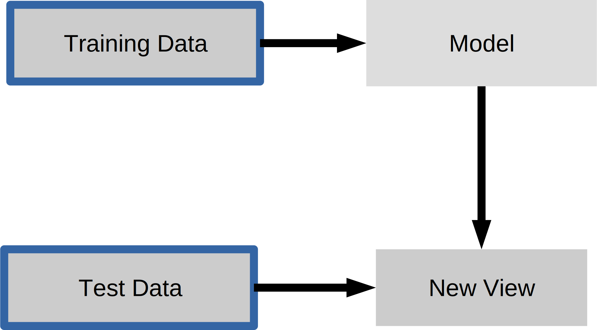

# 5.7 无监督学习第一部分：变换

许多无监督学习的实例，例如降维，流形学习和特征提取，在没有任何额外输入的情况下找到输入数据的新表示。 （与监督学习相反，如之前的分类和回归示例，无监督算法不需要或考虑目标变量）。



一个非常基本的例子是我们的数据重缩放，这是许多机器学习算法的要求，因为它们不是规模不变的 - 重缩放属于数据预处理类别，几乎不能称为学习。 存在许多不同的重缩放技术，在下面的示例中，我们将看一个通常称为“标准化”的特定方法。 在这里，我们将重缩放数据，使每个特征以零（均值为 0）为中心，具有单位方差（标准差为 1）。

例如，如果我们的一维数据集的值为`[1,2,3,4,5]`，则标准化值为：

+   1 -> -1.41
+   2 -> -0.71
+   3 -> 0.0
+   4 -> 0.71
+   5 -> 1.41

通过等式`z = (x - μ) / σ`计算，其中`μ`是样本均值，`σ`是标准差。

```py
ary = np.array([1, 2, 3, 4, 5])
ary_standardized = (ary - ary.mean()) / ary.std()
ary_standardized
```

尽管标准化是最基本的预处理过程 - 正如我们在上面的代码中看到的那样 - scikit-learn 为此计算实现了`StandardScaler`类。 在后面的部分中，我们将了解为什么以及何时 scikit-learn 接口在我们上面执行的代码片段中派上用场。

这样的预处理具有与我们迄今为止看到的监督学习算法非常相似的接口。 要使用 scikit-learn 的`Transformer`接口做更多练习，让我们首先加载鸢尾花数据集并重缩放它：

```py
from sklearn.datasets import load_iris
from sklearn.model_selection import train_test_split

iris = load_iris()
X_train, X_test, y_train, y_test = train_test_split(iris.data, iris.target, random_state=0)
print(X_train.shape)
```

鸢尾花数据集不是“居中”的，即它具有非零均值，并且每个分量的标准差不同：

```py
print("mean : %s " % X_train.mean(axis=0))
print("standard deviation : %s " % X_train.std(axis=0))
```

要使用预处理方法，我们首先导入估计器，这里是`StandardScaler`，并实例化它：

```py
from sklearn.preprocessing import StandardScaler
scaler = StandardScaler()
```

与分类和回归算法一样，我们调用`fit`来从数据中学习模型。 由于这是无监督的模型，我们只传递`X`而不是`y`。 这仅仅估计平均值和标准差。

```py
scaler.fit(X_train)
```

现在我们可以通过应用`transform`（不是`predict`）方法来重缩放数据：

```py
X_train_scaled = scaler.transform(X_train)
```

`X_train_scaled`具有相同数量的样本和特征，但减去了平均值，并且所有特征都被缩放，来具有单位标准差：

```py
print(X_train_scaled.shape)

print("mean : %s " % X_train_scaled.mean(axis=0))
print("standard deviation : %s " % X_train_scaled.std(axis=0))
```

总结一下：通过`fit`方法，估计器拟合我们提供的数据。 在该步骤中，估计器根据数据估计参数（这里是平均值和标准差）。 然后，如果我们转换数据，这些参数将用于转换数据集。 （请注意，`transform`方法不会更新这些参数）。

重要的是要注意，相同的转换应用于训练和测试集。 这导致通常在缩放后测试数据的平均值不为零：

```py
X_test_scaled = scaler.transform(X_test)
print("mean test data: %s" % X_test_scaled.mean(axis=0))
```

以完全相同的方式转换训练和测试数据非常重要，对于理解数据的以下处理步骤，如下图所示：

```py
from figures import plot_relative_scaling
plot_relative_scaling()
```

有几种常见的方法用于缩放数据。 最常见的是我们刚刚介绍的`StandardScaler`，但是使用`MinMaxScaler`重缩放数据，来固定最小值和最大值（通常在 0 和 1 之间），或使用更鲁棒的统计量（如中位数和分位数），而不是平均值和标准差（使用`RobustScaler`），也很有用。

```py
from figures import plot_scaling
plot_scaling()
```

## 主成分分析

主成分分析（PCA）是一种更有趣的无监督转换。这是一种技术，通过创建线性投影来降低数据维数。也就是说，我们寻找新的特征来表示数据，它是旧数据的线性组合（即我们旋转它）。因此，我们可以将 PCA 视为将数据投影到新的特征空间。

PCA 找到这些新方向的方式，是寻找最大方差的方向。通常只保留解释数据中大部分变化的少数成分。这里，前提是减少数据集的大小（维度），同时捕获其大部分信息。降维有用的原因很多：它可以在运行学习算法时降低计算成本，减少存储空间，并可能有助于所谓的“维度灾难”，我们将在后面详细讨论。

为了说明旋转的样子，我们首先在二维数据上显示它并保留两个主成分。这是一个例子：

```py
from figures import plot_pca_illustration
plot_pca_illustration()
```

现在让我们更详细地介绍所有步骤：我们创建一个旋转的高斯 blob：

```py
rnd = np.random.RandomState(5)
X_ = rnd.normal(size=(300, 2))
X_blob = np.dot(X_, rnd.normal(size=(2, 2))) + rnd.normal(size=2)
y = X_[:, 0] > 0
plt.scatter(X_blob[:, 0], X_blob[:, 1], c=y, linewidths=0, s=30)
plt.xlabel("feature 1")
plt.ylabel("feature 2");
```

与往常一样，我们实例化我们的 PCA 模型。 默认情况下，保留所有方向。

```py
from sklearn.decomposition import PCA
pca = PCA()
```

然后我们使用我们的数据拟合 PCA 模型。 由于 PCA 是无监督算法，因此没有输出`y`。

```py
pca.fit(X_blob)
```

然后我们可以转换数据，投影在主成分上：

```py
X_pca = pca.transform(X_blob)

plt.scatter(X_pca[:, 0], X_pca[:, 1], c=y, linewidths=0, s=30)
plt.xlabel("first principal component")
plt.ylabel("second principal component");

pca = PCA(n_components=1).fit(X_blob)

X_blob.shape

pca.transform(X_blob).shape
```

在图的左侧，你可以看到之前右上角的四个点。 PCA 发现第一个成分是沿对角线，第二个组件垂直于它。 当 PCA 发现旋转时，主成分始终彼此成直角（“正交”）。

# 将 PCA 降维用于可视化

考虑数字数据集。 它无法在单个 2D 绘图中可视化，因为它具有 64 个特征。 我们将使用`sklearn`示例中的[示例](http://scikit-learn.org/stable/auto_examples/manifold/plot_lle_digits.html)提取 2 个维度用于可视化。

```py
from figures import digits_plot

digits_plot()
```

请注意，此投影是在没有任何标签的信息（由颜色表示）的情况下确定的：这是无监督学习的意义。 然而，我们看到投影让我们深入了解参数空间中不同数字的分布。

> 练习
> 
> 使用前两个主成分可视化鸢尾花数据集，并将此可视化与使用两个原始特征进行比较。

```py
# %load solutions/07A_iris-pca.py
```
