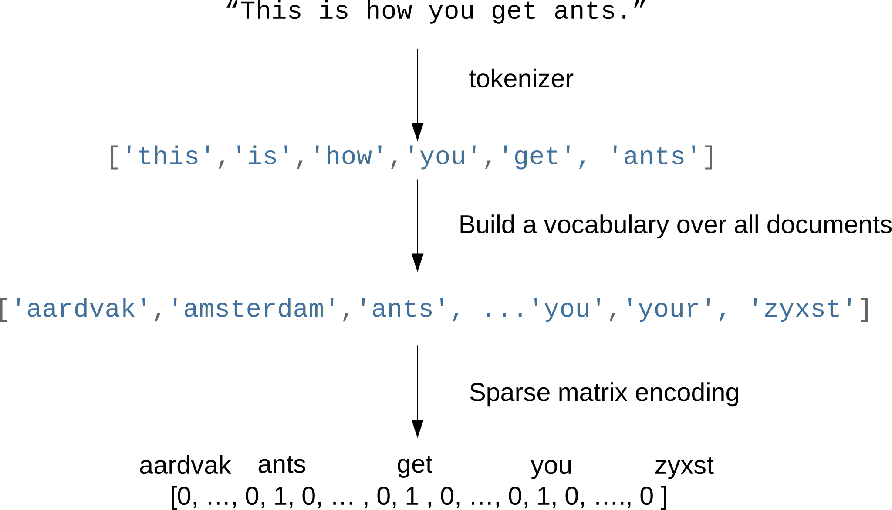

# 5.11 文本特征提取

在许多任务中，例如在经典的垃圾邮件检测中，你的输入数据是文本。 长度变化的自由文本与我们需要使用 scikit-learn 来做机器学习所需的，长度固定的数值表示相差甚远。 但是，有一种简单有效的方法，使用所谓的词袋模型将文本数据转换为数字表示，该模型提供了与 scikit-learn 中的机器学习算法兼容的数据结构。



假设数据集中的每个样本都表示为一个字符串，可以只是句子，电子邮件或整篇新闻文章或书籍。 为了表示样本，我们首先将字符串拆分为一个标记列表，这些标记对应于（有些标准化的）单词。 一种简单的方法，只需按空白字符分割，然后将单词变为小写。

然后，我们构建了一个所有标记（小写单词）的词汇表，标记出现在我们整个数据集中。 这通常是一个非常大的词汇表。 最后，看一下我们的单个样本，我们可以展示词汇表中每个单词出现的频率。 我们用向量表示我们的字符串，其中每个条目是词汇表中给定单词出现在字符串中的频率。

由于每个样本仅包含非常少的单词，因此大多数条目将为零，从而产生非常高维但稀疏的表示。

该方法被称为“词袋”，因为单词的顺序完全丢失。

```py
X = ["Some say the world will end in fire,",
     "Some say in ice."]

len(X)

from sklearn.feature_extraction.text import CountVectorizer

vectorizer = CountVectorizer()
vectorizer.fit(X)

vectorizer.vocabulary_

X_bag_of_words = vectorizer.transform(X)

X_bag_of_words.shape

X_bag_of_words

X_bag_of_words.toarray()

vectorizer.get_feature_names()

vectorizer.inverse_transform(X_bag_of_words)
```

## TF-IDF 编码

通常应用于词袋编码的有用变换，是所谓的“词频-逆文档频率”（tf-idf）缩放，其是单词计数的非线性变换。

tf-idf 编码重缩放通常具有较少权重的单词：

```py
from sklearn.feature_extraction.text import TfidfVectorizer

tfidf_vectorizer = TfidfVectorizer()
tfidf_vectorizer.fit(X)

import numpy as np
np.set_printoptions(precision=2)

print(tfidf_vectorizer.transform(X).toarray())
```

tf-idf 是一种将文档表示为特征向量的方法。 tf-idf 可以理解为原始词频（tf）的修改；tf 是给定文档中特定单词的出现频率。 tf-idf 背后的概念是。按照它们出现的文档数量，成比例减少词频的权重。 这里的想法是，对于文档分类等自然语言处理任务，许多不同文档中出现的单词可能不重要，或不包含任何有用的信息。 如果你对数学细节和方程感兴趣，请参阅[此外部 IPython Notebook](http://nbviewer.jupyter.org/github/rasbt/pattern_classification/blob/master/machine_learning/scikit-learn/tfidf_scikit-learn.ipynb)，它将引导你完成计算。

## Bigram 和 N-Gram

在本笔记本开头的图中所示的示例中，我们使用了所谓的 1-gram（unigram）分词：每个标记表示关于分割标准的单个元素。

完全抛弃单词顺序并不总是一个好主意，因为复合短语通常具有特定含义，而像“not”这样的修饰语可以颠倒单词的含义。

包含一些单词顺序的简单方法是 n-gram，它不仅查看单个标记，而且查看所有相邻标记对。例如，在 2-gram（bigram）分词中，我们使用一个单词的重叠将单词组合在一起；在 3-gram（trigram）分割中，我们将创建两个单词的重叠，依此类推：

+   原文："this is how you get ants"
+   1-gram："this", "is", "how", "you", "get", "ants"
+   1-gram："this", "is", "how", "you", "get", "ants"
+   2-gram："this is", "is how", "how you", "you get", "get ants"
+   3-gram："this is how", "is how you", "how you get", "you get ants"

为了在我们的预测模型中获得最佳效果，我们选择哪个“n”用于“n-gram”分词取决于学习算法，数据集和任务。或者换句话说，我们将“n-gram”中的“n”视为需要调整的参数，在后面的笔记本中，我们将看到我们如何处理它们。

现在，让我们使用 scikit-learn 的`CountVectorizer`创建一个 bigram 的词袋模型：

```py
# look at sequences of tokens of minimum length 2 and maximum length 2
bigram_vectorizer = CountVectorizer(ngram_range=(2, 2))
bigram_vectorizer.fit(X)

bigram_vectorizer.get_feature_names()

bigram_vectorizer.transform(X).toarray()
```

通常我们想要包括 unigram（单个标记）和 bigram，我们可以将以下元组作为参数传递给`CountVectorizer`函数的`ngram_range`参数：

```py
gram_vectorizer = CountVectorizer(ngram_range=(1, 2))
gram_vectorizer.fit(X)

gram_vectorizer.get_feature_names()

gram_vectorizer.transform(X).toarray()
```

## 字符 n-gram

有时不仅是查看单词，考虑单个字符也有帮助。

如果我们有非常嘈杂的数据并想要识别语言，或者我们想要预测一个单词的某些内容，那么这一点尤其有用。 我们可以通过设置`analyzer ="char"`来简单地查看字符而不是单词。 查看单个字符通常不是很有用，但是查看更长的`n`个字符可能是：

```py
X

char_vectorizer = CountVectorizer(ngram_range=(2, 2), analyzer="char")
char_vectorizer.fit(X)

print(char_vectorizer.get_feature_names())
```

> 练习
> 
> 从下面给出（或者通过`import this`）的“zen of python”中计算 bigrams，并找到最常见的 trigram。 我们希望将每一行视为单独的文档。 你可以通过按照换行符（`\ n`）分割字符串来实现。 计算数据的 Tf-idf 编码。 哪个词的 tf-idf 得分最高？ 为什么？ 如果使用`TfidfVectorizer(norm="none")`会有什么变化？

```py
zen = """Beautiful is better than ugly.
Explicit is better than implicit.
Simple is better than complex.
Complex is better than complicated.
Flat is better than nested.
Sparse is better than dense.
Readability counts.
Special cases aren't special enough to break the rules.
Although practicality beats purity.
Errors should never pass silently.
Unless explicitly silenced.
In the face of ambiguity, refuse the temptation to guess.
There should be one-- and preferably only one --obvious way to do it.
Although that way may not be obvious at first unless you're Dutch.
Now is better than never.
Although never is often better than *right* now.
If the implementation is hard to explain, it's a bad idea.
If the implementation is easy to explain, it may be a good idea.
Namespaces are one honking great idea -- let's do more of those!"""

# %load solutions/11_ngrams.py
```
