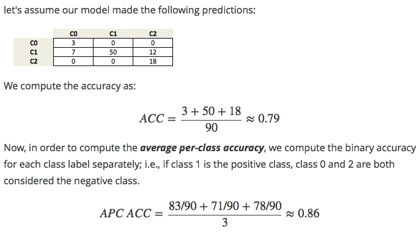

# 5.16 模型评估、得分指标和处理不平衡类别

在之前的笔记本中，我们已经详细介绍了如何评估模型，以及如何选择最佳模型。 到目前为止，我们假设我们得到了表现的度量，它度量模型的质量。 但是，应该使用什么度量标准并不总是显而易见的。 scikit-learn 中的默认分数，对于分类是准确率，即正确分类的样本的比例，对于回归是 r2 得分，是确定系数。

在许多情况下，这些是合理的默认选择；但是，根据我们的任务，这些并不总是最终或推荐的选择。

让我们更详细地看一下分类，回到手写数字分类的应用。 那么，如何训练分类器并使用不同的方式进行评估呢？ Scikit-learn 在 sklearn.metrics 模块中有许多有用的方法，可以帮助我们完成这项任务：

```py
%matplotlib inline
import matplotlib.pyplot as plt
import numpy as np
np.set_printoptions(precision=2)

from sklearn.datasets import load_digits
from sklearn.model_selection import train_test_split
from sklearn.svm import LinearSVC

digits = load_digits()
X, y = digits.data, digits.target
X_train, X_test, y_train, y_test = train_test_split(X, y, 
                                                    random_state=1,
                                                    stratify=y,
                                                    test_size=0.25)

classifier = LinearSVC(random_state=1).fit(X_train, y_train)
y_test_pred = classifier.predict(X_test)

print("Accuracy: {}".format(classifier.score(X_test, y_test)))
```

在这里，我们正确预测了 95.3% 的样本。 对于多类问题，通常很有趣的是，知道哪些类很难预测，哪些类很容易，或哪些类混淆了。 获取错误分类的更多信息的一种方法，是`confusion_matrix`，它为每个真正的类显示给定预测结果的频率。

```py
from sklearn.metrics import confusion_matrix
confusion_matrix(y_test, y_test_pred)
```

绘图有时更可读：

```py
plt.matshow(confusion_matrix(y_test, y_test_pred), cmap="Blues")
plt.colorbar(shrink=0.8)
plt.xticks(range(10))
plt.yticks(range(10))
plt.xlabel("Predicted label")
plt.ylabel("True label");
```

我们可以看到大多数条目都在对角线上，这意味着我们正确地预测了几乎所有样本。 非对角线的条目向我们显示许多 8 被归类为 1，并且 9 很可能与许多其他类混淆。

另一个有用的函数是`classification_report`，它为所有类提供精确率，召回率，f 得分和支持度。 精确率是一个类有多少预测实际上是那个类。 TP，FP，TN，FN 分别代表“真正例”，“假正例”，“真负例”和“假负例”：

```
Precision = TP / (TP + FP)
```

召回率是有多少真正例被复原：

```
Recall = TP / (TP + FN)
```

F1 得分是二者的调和均值：

```
F1 = 2 x (precision x recall) / (precision + recall)
```

上述所有这些值的值都在闭区间`[0,1]`中，其中 1 表示完美得分。

```py
from sklearn.metrics import classification_report
print(classification_report(y_test, y_test_pred))
```

这些指标有助于实践中经常出现的两种特殊情况：

+   不平衡类别，即一个类可能比另一个类更频繁。
+   非对称成本，即一种错误比另一种更“昂贵”。

首先我们来看看第一个。 假设我们有 1:9 的不平衡类别，这是相当温和的（想想广告点击预测，只有 0.001% 的广告可能会被点击）：

```py
np.bincount(y) / y.shape[0]
```

作为一个玩具示例，假设我们想要划分数字三和所有其他数字：

```py
X, y = digits.data, digits.target == 3
```

现在我们在分类器上运行交叉验证，看看它有多好：

我们的分类器准确率为 90%。 这样好吗？ 还是不好？ 请记住，90% 的数据“不是三”。 因此，让我们看看虚拟分类器的表现如何，它始终预测最频繁的类：

```py
from sklearn.dummy import DummyClassifier
cross_val_score(DummyClassifier("most_frequent"), X, y)
```

也是 90%（正如预期的那样）！ 所以有一种可能，我们的分类器不是很好，它并不比一个甚至不看数据的简单策略更好。 不过，这个判断太快了。 准确性根本不是评估不平衡数据集的分类器的好方法！

```py
np.bincount(y) / y.shape[0]
```

## ROC 曲线

更好的衡量标准是使用所谓的 ROC（受试者工作特性）曲线。 ROC 曲线处理分类器的不确定性输出，比如我们上面训练的 SVC 的“决策函数”。 它不是在 0 处截断并查看分类结果，而是查看每个可能的截断值并记录有多少真正例预测，以及有多少假正例预测。

下图比较了在“三和其它”任务上，我们的分类器的三个参数设置的 roc 曲线。

```py
from sklearn.metrics import roc_curve, roc_auc_score

X_train, X_test, y_train, y_test = train_test_split(X, y, random_state=42)

for gamma in [.05, 0.1, 0.5]:
    plt.xlabel("False Positive Rate")
    plt.ylabel("True Positive Rate (recall)")
    svm = SVC(gamma=gamma).fit(X_train, y_train)
    decision_function = svm.decision_function(X_test)
    fpr, tpr, _ = roc_curve(y_test, decision_function)
    acc = svm.score(X_test, y_test)
    auc = roc_auc_score(y_test, svm.decision_function(X_test))
    label = "gamma: %0.3f, acc:%.2f auc:%.2f" % (gamma, acc, auc)
    plt.plot(fpr, tpr, label=label, linewidth=3)
plt.legend(loc="best");
```

由于决策阈值非常小，假正例很低，但假负例也很少，但是阈值非常高的话，真正例率和假负例率都很高。所以一般来说，曲线将从左下角到右上角。对角线反映了机会表现，而目标是尽可能在左上角。这意味着与任何负样本相比，为所有正样本提供更高的`decision_function`值。

在这个意义上，该曲线仅考虑正样本和负样本的排名，而不是实际值。从图例中的曲线和准确率值可以看出，即使所有分类器具有相同的准确率，89%，甚至低于虚拟分类器，其中一个具有完美的 roc 曲线，而其中一个表现出机会水平。

对于网格搜索和交叉验证，我们通常希望将模型评估压缩为单个数字。使用 roc 曲线的一个好方法是使用曲线下面积（AUC）。我们可以通过指定`scoring ="roc_auc"`在`cross_val_score`中使用它：

```py
from sklearn.model_selection import cross_val_score
cross_val_score(SVC(gamma='auto'), X, y, scoring="roc_auc", cv=5)
```

## 内建和自定义的得分函数

还有更多可用的评分方法，可用于不同类型的任务。 你可以在`SCORERS`字典中找到它们。 唯一的文档解释了所有这些。

```py
from sklearn.metrics.scorer import SCORERS
print(SCORERS.keys())
```

你也可以定义自己的得分指标。 你可以提供一个可调用对象作为`scoring`参数，而不是字符串，即具有`__call__`方法对象或函数。 它需要接受模型，测试集特征`X_test`和测试集标签`y_test`，并返回一个浮点数。 更高的浮点意味着更好的模型。

让我们重新实现标准准确率得分：

```py
def my_accuracy_scoring(est, X, y):
    return np.mean(est.predict(X) == y)

cross_val_score(SVC(), X, y, scoring=my_accuracy_scoring)
```

> 练习
> 
> 在前面的章节中，我们通常使用准确率度量来评估分类器的表现。 我们还没有谈到的相关措施是平均每类准确率（APCA）。 我们记得，准确性定义为：
> 
> ```
> ACC = (TP + TN) / n
> ```
> 
> 其中`n`是样本总数。 这可以推广为：
> 
> ```
> ACC = T / N
> ```
> 
> 其中`T`是多类设置中所有正确预测的数量。
> 
> 给定以下“真实”类标签和预测类标签数组，你是否可以实现一个函数，使用准确率度量来计算平均每类准确率，如下所示？
> 
> 

```py
y_true = np.array([0, 0, 0, 1, 1, 1, 1, 1, 2, 2])
y_pred = np.array([0, 1, 1, 0, 1, 1, 2, 2, 2, 2])

confusion_matrix(y_true, y_pred)

# %load solutions/16A_avg_per_class_acc.py
```
