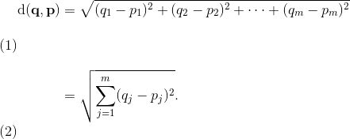
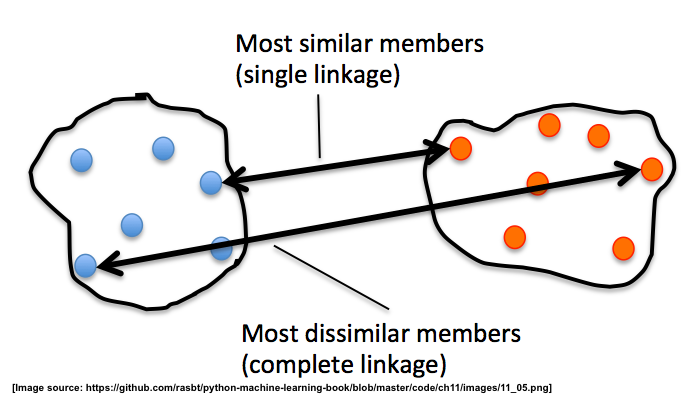
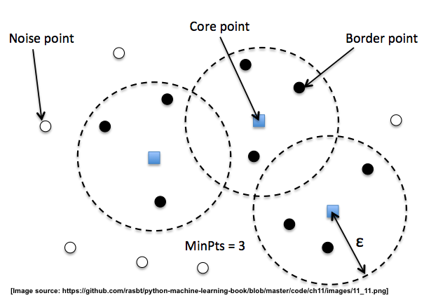

# 5.20 无监督学习：层次和基于密度的聚类算法

在第八章中，我们介绍了一种必不可少且广泛使用的聚类算法 K-means。 K-means 的一个优点是它非常容易实现，并且与其他聚类算法相比，它在计算上也非常有效。 然而，我们已经看到 K-Means 的一个缺点是它只有在数据可以分组为球形时才能正常工作。 此外，我们必须事先指定簇的数量`k` - 如果我们没有我们期望找到多少个簇的先验知识，这可能是一个问题。

在本笔记本中，我们将介绍两种可选的聚类方法，层次聚类和基于密度的聚类。

## 层次聚类

层次聚类的一个很好的特性是，我们可以将结果可视化为树状图，即层次树。 使用可视化，我们可以通过设置“深度”阈值来决定我们希望数据集的簇有多“深”。 或者换句话说，我们不需要预先决定簇的数量。

## 聚合和分裂的层次聚类

此外，我们可以区分两种主要的层次聚类方法：分裂聚类和聚合聚类。 在聚合聚类中，我们从数据集中的单个样本开始，并迭代地将其与其他样本合并以形成簇 - 我们可以将其视为构建簇的树状图的自底向上的方法。
然而，在分裂聚类中，我们从作为一个簇的整个数据集开始，并且我们迭代地将其拆分成更小的子簇 - 自顶向下的方法。

在这个笔记本中，我们将使用聚合聚类。

## 单个和完整链接

现在，下一个问题是我们如何测量样本之间的相似性。 一种方法是我们已经在 K-Means 算法中使用的，熟悉的欧几里德距离度量。 作为回顾，两个`m`维向量`p`和`q`之间的距离可以计算为：



然而，这是两个个样本之间的距离。 现在，我们如何计算样本子集之间的相似性，以便在构建树状图时决定合并哪些簇？ 即，我们的目标是迭代地合并最相似的一对簇，直到只剩下一个大簇。 有许多不同的方法，例如单个和完整链接。

在单个链接中，我们在每两个簇中选取一对最相似的样本（例如，基于欧几里德距离），并将具有最相似的两个成员的两个簇合并为一个新的更大的簇。

在完整链接中，我们比较每两个簇的两个最不相似的成员，并且我们合并两个簇，其中两个最不相似的成员之间的距离最小。

> 译者注：还有比较两个簇形心的方法，算是一种折中。



为了看到实际的聚合层次聚类方法，让我们加载熟悉的鸢尾花数据集 - 我们假装不知道真正的类标签，并想要找出它包含多少不同的物种：

```py
from sklearn.datasets import load_iris
from figures import cm3

iris = load_iris()
X = iris.data[:, [2, 3]]
y = iris.target
n_samples, n_features = X.shape

plt.scatter(X[:, 0], X[:, 1], c=y, cmap=cm3)
```

首先，我们从一些探索性聚类开始，使用 SciPy 的`linkage`和`dendrogram`函数来可视化簇的树状图：

```py
from scipy.cluster.hierarchy import linkage
from scipy.cluster.hierarchy import dendrogram

clusters = linkage(X, 
                   metric='euclidean',
                   method='complete')

dendr = dendrogram(clusters)

plt.ylabel('Euclidean Distance')
```

接下来，让我们使用来自 scikit-learn 的`AgglomerativeClustering`估计器，并将数据集划分为 3 个簇。你能猜出它会重现的树状图中有哪 3 个簇吗？

```py
from sklearn.cluster import AgglomerativeClustering

ac = AgglomerativeClustering(n_clusters=3,
                             affinity='euclidean',
                             linkage='complete')

prediction = ac.fit_predict(X)
print('Cluster labels: %s\n' % prediction)

plt.scatter(X[:, 0], X[:, 1], c=prediction, cmap=cm3)
```

## 基于密度的聚类 - DBSCAN

另一种有用的聚类方法是“具有噪声的基于密度的聚类方法”（DBSCAN）。 本质上，我们可以将 DBSCAN 视为一种算法，该算法根据密集的点区域将数据集划分为子分组。

在 DBSCAN 中，我们区分了 3 种不同的“点”：

+   核心点：核心点是一个点，在其半径`epsilon`内，至少具有最小数量（`MinPts`）的其他点。
+   边界点：边界点是一个点，它不是核心点，因为它的邻域中没有足够的`MinPts`，但位于核心点的半径`epsilon`内。
+   噪点：所有其他的点，既不是核心点也不是边界点。



DBSCAN 的一个很好的特性是我们不必预先指定多少个簇。 但是，它需要设置其他超参数，例如`MinPts`的值和半径`epsilon`。

```py
from sklearn.datasets import make_moons
X, y = make_moons(n_samples=400,
                  noise=0.1,
                  random_state=1)
plt.scatter(X[:,0], X[:,1])
plt.show()
from sklearn.cluster import DBSCAN

db = DBSCAN(eps=0.2,
            min_samples=10,
            metric='euclidean')
prediction = db.fit_predict(X)

print("Predicted labels:\n", prediction)

plt.scatter(X[:, 0], X[:, 1], c=prediction, cmap=cm3)
```

> 练习
> 
> 使用以下玩具数据集，两个同心圆，尝试我们到目前为止使用的三种不同的聚类算法：`KMeans`，`AgglomerativeClustering`和`DBSCAN`。 哪种聚类算法能够最好地再现或发现隐藏的结构（假装我们不知道`y`）？ 你能解释为什么这个特殊的算法是一个不错的选择，而另外两个“失败”了？

```py
from sklearn.datasets import make_circles

X, y = make_circles(n_samples=1500, 
                    factor=.4, 
                    noise=.05)

plt.scatter(X[:, 0], X[:, 1], c=y);

# %load solutions/20_clustering_comparison.py
```
